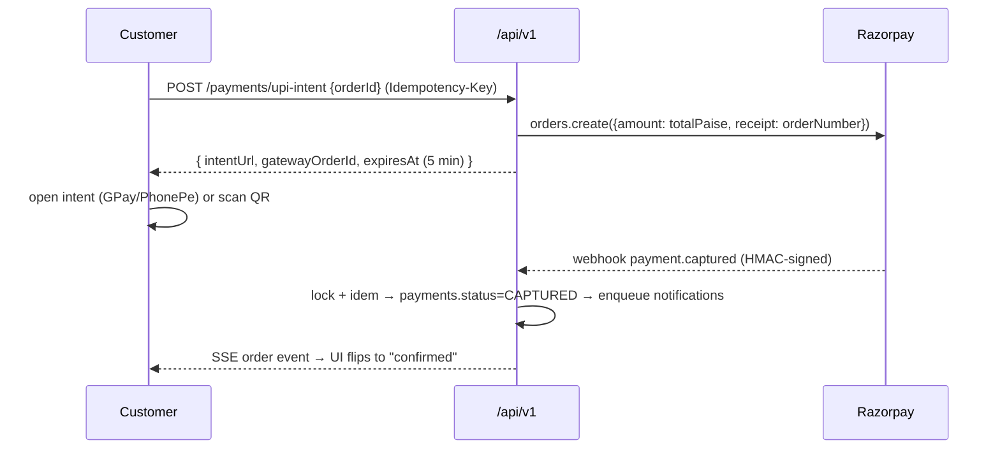

# 09 — Payments

> plan.md §13. Gateway: **Razorpay** (test keys on staging). Money at boundaries is always integer paise (ADR-005).

## 9.1 Methods
| Method | Availability | Rules |
|:--|:--|:--|
| `UPI_INTENT` (primary) | Phase 6 | creates Razorpay order (`RAZORPAY_KEY_ID`/`RAZORPAY_KEY_SECRET`, plan §19) → `intentUrl` (`upi://pay?…`) + QR fallback on desktop |
| `GATEWAY_ONLINE` | Phase 6 (card/netbanking via Razorpay checkout) | same capture/webhook path |
| `CASH_ON_DELIVERY` | Phase 6 | only if `totalPaise ≤ config.codMaxPaise` (default ₹50000) |
| Platform fee | always | campus config `platform_fee_pct` (column), seeded from `PLATFORM_FEE_PCT` (plan §19) |
| `CAMPUS_WALLET` | **reserved, not built** | no UI exposure until Phase 8+ ADR |

## 9.2 UPI Intent Flow (customer)

- While capture is pending the client shows `PAYMENT_PENDING` (202 semantics) with a rate-limited (3/min) **“Check status”** refresh button hitting the same endpoint (idempotent).
- Expired intent (5 min) → regenerate freely; old gateway orders are reconciled/ignored.

## 9.3 Webhook Pipeline (exact handler order — normative)
```ts
// POST /api/v1/webhooks/razorpay — must respond < 5 s
1. read RAW body (bypass JSON middleware)                 // signature is over raw bytes
2. verify HMAC-SHA256(raw, RAZORPAY_WEBHOOK_SECRET)       // mismatch → 400 + security.log, no state change
3. parse event; eventId = event.id
4. withLock(`webhook:${eventId}`, 30s) {
     if (idemSeen(`webhook:${eventId}`)) return 200;      // retries are no-ops
     switch (event.type) {
       case "payment.captured": markCaptured(); notify(); break;
       case "payment.failed":   markFailed(); autoCancelOrder(); restoreCart(); break;
       default: logger.info("ignored_event", {type});      // verified but unknown → still 200
     }
     idemMark(`webhook:${eventId}`);                       // 24 h
   }
5. respond 200
```
Signature verification sketch:
```ts
import crypto from "node:crypto";
const expected = crypto.createHmac("sha256", env.RAZORPAY_WEBHOOK_SECRET).update(rawBody).digest("hex");
if (!crypto.timingSafeEqual(Buffer.from(expected), Buffer.from(sig))) throw new Error("bad_signature");
```

## 9.4 Reconciliation (covers missed webhooks)
BullMQ repeatable `payment-reconcile` every 5 min:
1. select `payments` where `status='PENDING'` and `created_at < now()-10min`;
2. query Razorpay Orders API by `gateway_order_id`;
3. apply terminal state through the **same** `markCaptured/markFailed` functions (same invariants, same events);
4. anything still unknown after 3 passes → Sentry alert `payment.reconcile_stuck`.

## 9.5 Refunds & Cancellations
| Trigger | Path |
|:--|:--|
| Customer cancels within 120 s of `PLACED` | `POST /orders/{id}/cancel` → if CAPTURED → gateway refund job |
| Shop rejects / auto-cancel (timeout) | system refund + `notifications` SMS `REFUND_CLOSED` |
| Dispute resolution | QUERY_RESOLVER issues refund → `payments.status=REFUNDED` + `audit_logs` entry `REFUND_ISSUED` (amount, reason, actor) |

Refund jobs are idempotent (per payment, `gb:lock:refund:{paymentId}`) and re-run on reconcile until gateway confirms.

## 9.6 Money Invariants (re-checked in code, mirrored as DB CHECKs)
1. `items_subtotal + delivery_fee + platform_fee + tax_fee == total_amount`
2. each line: `total_price == unit_price * quantity`
3. `payments.amount == orders.total_amount`
4. API carries only integer `*_paise`; conversions exclusively via `toPaise()/fromPaise()`.

## 9.7 Testing Payments Locally
- Staging/production: real Razorpay keys. Local: `RAZORPAY_KEY_*` unset → `MockGatewayProvider` returns immediate capture after 2 s (drives the same webhook code path internally).
- Razorpay dashboard test cards/UPI (`success@razorpay`) for end-to-end on staging; webhook URL = `https://<staging-domain>/api/v1/webhooks/razorpay` (use `stripe-like` CLI? no — use Razorpay dashboard + ngrok only if needed).

→ Next: [Background Jobs & Workers](10-jobs-workers.md)
